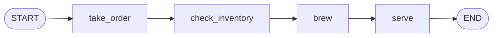

# Nodes
> Venkata Bhattaram (c) 2026

## Contents
* Defining a node function
* Node inputs and outputs
* Sync vs async nodes

## Overview
A node is any callable that accepts the current state and returns a partial
state update — a plain function, a method, or a coroutine. LangGraph doesn't
care which, as long as the input/output shape matches the graph's state.
Use a plain `def` for CPU-bound or synchronous work, and `async def` for
I/O-bound work (API calls, database queries) so the graph can be run with
`ainvoke`/`astream` and overlap concurrent work efficiently.

## Code Example
```python
"""Sync and async nodes living in the same graph."""
import asyncio
from typing import TypedDict

from langgraph.graph import StateGraph, START, END


class OrderState(TypedDict):
    order_id: str
    is_valid: bool
    total: float


def validate_order(state: OrderState) -> dict:
    """Sync node: pure, CPU-only logic."""
    return {"is_valid": state["total"] > 0}


async def fetch_shipping_estimate(state: OrderState) -> dict:
    """Async node: simulates an I/O-bound call, e.g. a shipping API."""
    await asyncio.sleep(0.1)
    return {"total": state["total"] + 5.0}


builder = StateGraph(OrderState)
builder.add_node("validate_order", validate_order)
builder.add_node("fetch_shipping_estimate", fetch_shipping_estimate)

builder.add_edge(START, "validate_order")
builder.add_edge("validate_order", "fetch_shipping_estimate")
builder.add_edge("fetch_shipping_estimate", END)

graph = builder.compile()


# Because the graph contains an async node, it must be run through the async
# API — graph.invoke() would raise TypeError("No synchronous function
# provided to ...") since there is no sync implementation to fall back to.
async def main() -> None:
    result = await graph.ainvoke(
        {"order_id": "A101", "is_valid": False, "total": 100.0}
    )
    print(result)


asyncio.run(main())
```

## Worked Example: Coffee Order Pipeline
Think of a coffee shop counter. Each barista station does **one job**, looks
at the whole order ticket, and writes back only the fields it is responsible
for. In LangGraph each station is a node and the order ticket is the state.



Full runnable file: [coffee_order_pipeline.py](../code/coffee_order_pipeline.py)

```python
"""Coffee order pipeline: four nodes, one job each, partial updates only."""
import asyncio
from typing import TypedDict

from langgraph.graph import StateGraph, START, END


# Step 1: Set up the shop's reference data (plain Python, not part of the graph).
MENU = {"latte": 4.50, "espresso": 3.00, "cappuccino": 4.00}
SIZE_MULTIPLIER = {"small": 1.0, "medium": 1.25, "large": 1.5}
INVENTORY = {"latte": 10, "espresso": 0, "cappuccino": 5}


# Step 2: Define the state, the "order ticket" every node can read.
# Nodes may only write keys that are declared here.
class CoffeeOrder(TypedDict):
    drink: str
    size: str
    price: float
    in_stock: bool
    cup: str
    status: str


# Step 3: Node 1, take_order. Prices the order and returns only the keys it
# changed (price, status); every other key is left untouched.
def take_order(state: CoffeeOrder) -> dict:
    """Sync node: pure calculation, prices the order."""
    price = MENU[state["drink"]] * SIZE_MULTIPLIER[state["size"]]
    return {"price": round(price, 2), "status": "ordered"}


# Step 4: Node 2, check_inventory. An async node, because a real stock check
# would be I/O (database/API). asyncio.sleep stands in for that call.
async def check_inventory(state: CoffeeOrder) -> dict:
    """Async node: simulates an I/O-bound stock lookup."""
    await asyncio.sleep(0.1)
    return {"in_stock": INVENTORY.get(state["drink"], 0) > 0}


# Step 5: Node 3, brew. Reads in_stock, written by the previous node, and
# returns a different update depending on it. Sold out -> cup is never set.
def brew(state: CoffeeOrder) -> dict:
    """Sync node: reads earlier updates and decides what to make."""
    if not state["in_stock"]:
        return {"status": "sold out"}
    return {"cup": f"{state['size']} {state['drink']}", "status": "brewed"}


# Step 6: Node 4, serve. Overwrites status (last writer wins) and reads
# price, which take_order wrote three steps earlier.
def serve(state: CoffeeOrder) -> dict:
    """Sync node: final hand-off, only touches status."""
    if state["status"] != "brewed":
        return {"status": f"refunded ${state['price']:.2f}"}
    return {"status": "served"}


# Step 7: Create a graph builder bound to the CoffeeOrder state schema.
builder = StateGraph(CoffeeOrder)

# Step 8: Register each function as a named node. The name (first argument)
# is what edges and streamed output refer to.
builder.add_node("take_order", take_order)
builder.add_node("check_inventory", check_inventory)
builder.add_node("brew", brew)
builder.add_node("serve", serve)

# Step 9: Wire the nodes into a straight line: START -> ... -> END.
builder.add_edge(START, "take_order")
builder.add_edge("take_order", "check_inventory")
builder.add_edge("check_inventory", "brew")
builder.add_edge("brew", "serve")
builder.add_edge("serve", END)

# Step 10: Compile the builder into a runnable graph.
graph = builder.compile()


# Step 11: run_order runs one customer order through the graph.
async def run_order(drink: str, size: str) -> None:
    # Step 11a: Build the initial state. The customer supplies drink and size;
    # the other keys hold placeholders that the nodes will fill in.
    initial = {
        "drink": drink,
        "size": size,
        "price": 0.0,
        "in_stock": False,
        "cup": "",
        "status": "new",
    }
    print(f"\n--- Order: {size} {drink} ---")

    # Step 11b: Stream the run. stream_mode="updates" yields
    # {node_name: partial_update} after each node, so you can see exactly
    # which keys each node changed.
    async for step in graph.astream(initial, stream_mode="updates"):
        for node_name, update in step.items():
            print(f"{node_name:>16} -> {update}")

    # Step 11c: Run again with ainvoke to get the final merged state.
    # (Async API is required because check_inventory is async.)
    final = await graph.ainvoke(initial)
    print(f"{'final state':>16} -> {final}")


# Step 12: Place two orders: one in stock (latte), one sold out (espresso).
async def main() -> None:
    await run_order("latte", "large")
    await run_order("espresso", "small")


# Step 13: Start the async event loop.
asyncio.run(main())
```

### Output
```
--- Order: large latte ---
      take_order -> {'price': 6.75, 'status': 'ordered'}
 check_inventory -> {'in_stock': True}
            brew -> {'cup': 'large latte', 'status': 'brewed'}
           serve -> {'status': 'served'}
     final state -> {'drink': 'latte', 'size': 'large', 'price': 6.75, 'in_stock': True, 'cup': 'large latte', 'status': 'served'}

--- Order: small espresso ---
      take_order -> {'price': 3.0, 'status': 'ordered'}
 check_inventory -> {'in_stock': False}
            brew -> {'status': 'sold out'}
           serve -> {'status': 'refunded $3.00'}
     final state -> {'drink': 'espresso', 'size': 'small', 'price': 3.0, 'in_stock': False, 'cup': '', 'status': 'refunded $3.00'}
```

### Code Explanation

**1. The state is the order ticket.**
`CoffeeOrder` lists every field any node may read or write. The customer
fills in `drink` and `size`. The other fields start with placeholder values
and are filled in by the nodes as the order moves along.

**2. Each node has exactly one job.**

| Node | Kind | Reads | Writes | Job |
|------|------|-------|--------|-----|
| `take_order` | sync | `drink`, `size` | `price`, `status` | Look up the menu price and apply the size multiplier |
| `check_inventory` | async | `drink` | `in_stock` | Simulated stock lookup (stands in for a DB/API call) |
| `brew` | sync | `in_stock`, `size`, `drink` | `cup`, `status` | Make the drink, or mark it sold out |
| `serve` | sync | `status`, `price` | `status` | Hand over the drink, or refund |

Keeping nodes this small makes each one easy to read, test and replace.

**3. Nodes return partial updates, not the whole state.**
Look at the streamed output: `check_inventory` returns only
`{'in_stock': True}`. It does not repeat `drink`, `price` or anything else.
LangGraph merges each returned dict into the current state. Keys a node does
not return are left as they are. Think of it as a *commit* that changes a
few lines, not a rewrite of the whole file.

**4. Later nodes see earlier updates.**
`brew` reads `in_stock`, which `check_inventory` wrote one step earlier.
`serve` reads `price`, written by `take_order` three steps earlier. Nodes
never call each other or pass arguments directly. They communicate **only
through the state**.

**5. Overwriting a key is normal.**
`status` is written by three nodes (`ordered` → `brewed` → `served`). With
a plain `TypedDict` key the last writer wins. (Reducers, which combine values
instead of overwriting them, are covered in State Management.)

**6. A node can decide what to write.**
`brew` returns different updates depending on the state. For a sold-out
espresso it returns only `{'status': 'sold out'}` and never sets `cup`,
so `cup` stays `''` in the final state. The graph path itself doesn't change
here; branching to *different nodes* is what conditional edges are for.

**7. Mixing sync and async nodes.**
`check_inventory` is `async def` because it simulates I/O. Since the graph
contains one async node, it is run with `astream` / `ainvoke`. The sync nodes
work unchanged alongside it.

**8. Watching nodes run with `stream_mode="updates"`.**
`astream(..., stream_mode="updates")` yields one `{node_name: update}` dict
per node as it finishes. It's the easiest way to see exactly what each node
contributed. `ainvoke` then returns the final merged state.

> **Tip:** Because nodes are plain functions, you can unit-test one without
> building a graph:
> `take_order({"drink": "latte", "size": "large"})` returns
> `{'price': 6.75, 'status': 'ordered'}`.

## Conclusion
Nodes are ordinary Python callables with one contract: take state in, return
a partial update out. A graph built entirely from sync nodes can be run with
`invoke`/`stream`; as soon as a single node is `async def`, the graph must be
run through `ainvoke`/`astream` instead. Reach for `async def` whenever a
node does network or disk I/O, and call the graph accordingly.
