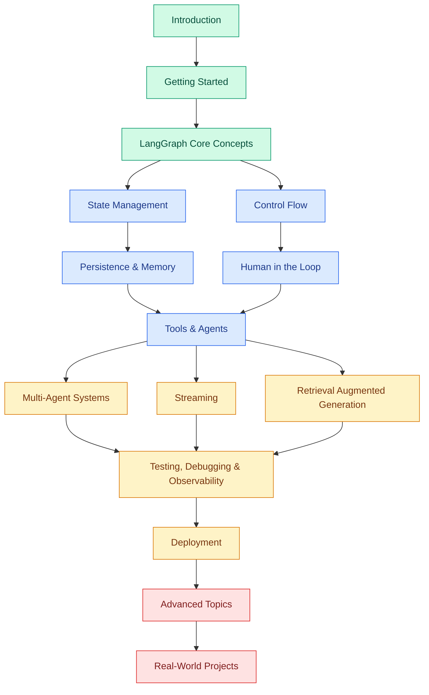

# LangGraph Tutorial
> Venkata Bhattaram (c) 2026

An extensive, beginner-to-expert LangGraph tutorial with hands-on code examples — from installing LangGraph and building your first graph, through state management, control flow, persistence, human-in-the-loop, multi-agent systems, and production deployment.

## Learning Path

Green = Beginner &nbsp;|&nbsp; Blue = Intermediate &nbsp;|&nbsp; Orange = Advanced &nbsp;|&nbsp; Red = Expert

## CONTENTS
### [Introduction](./01-getting-started/md/introduction.md)
### Getting Started
#### [Installation](./01-getting-started/md/installation.md)
* Installing langgraph
* Installing langchain and provider SDKs
* Verifying the installation
* Choosing a Python version
#### [Environment Setup](./01-getting-started/md/environment_setup.md)
* API keys and .env files
* Virtual environments
* IDE setup (VS Code)
* LangGraph Studio setup
#### [Basics](./01-getting-started/md/basics.md)
* State
* Graph
* Node
* Edge
* Compile
* Invoke

---
### LangGraph Core Concepts
#### [Your First Graph](./02-langgraph-core-concepts/md/your_first_graph.md)
* Hello-world StateGraph
* Defining state
* Adding a node
* Compiling and invoking
* Visualizing the graph
---
#### [Graphs and State](./02-langgraph-core-concepts/md/graphs_and_state.md)
* What is a graph in LangGraph
* State as the single source of truth
* Message passing between nodes
---
#### [Nodes](./02-langgraph-core-concepts/md/nodes.md)
* Defining a node function
* Node inputs and outputs
* Sync vs async nodes
---
#### [Edges](./02-langgraph-core-concepts/md/edges.md)
* Normal edges
* START and END
* Sequencing nodes
---
#### [Conditional Edges](./02-langgraph-core-concepts/md/conditional_edges.md)
* Routing functions
* add_conditional_edges
* Dynamic branching
---
#### [Compiling and Invoking a Graph](./02-langgraph-core-concepts/md/compiling_and_invoking_a_graph.md)
* graph.compile()
* invoke vs stream vs batch
* Config and recursion_limit

---

### State Management
#### [State Schemas](./03-state-management/md/state_schemas.md)
* TypedDict state
* Dataclass state
* Pydantic state
#### [Reducers](./03-state-management/md/reducers.md)
* Default overwrite behavior
* Annotated reducers
* operator.add and add_messages
#### [Multiple Schemas (Input/Output/Internal)](./03-state-management/md/multiple_schemas.md)
* Separate input and output schemas
* Private internal state
* Overlapping keys
#### [Messages State](./03-state-management/md/messages_state.md)
* MessagesState
* add_messages reducer
* Trimming and filtering message history

---

### Control Flow
#### [Branching](./04-control-flow/md/branching.md)
* If/else style routing
* Multiple destination edges
#### [Looping](./04-control-flow/md/looping.md)
* Cycles in a graph
* Loop termination conditions
* Recursion limits
#### [Parallel Execution (Fan-Out/Fan-In)](./04-control-flow/md/parallel_execution.md)
* Fan-out to multiple nodes
* Fan-in and merging state
* The superstep execution model
#### [Map-Reduce with Send](./04-control-flow/md/map_reduce_with_send.md)
* The Send object
* Dynamic parallel branches
* Aggregating results
#### [Subgraphs](./04-control-flow/md/subgraphs.md)
* Nesting graphs as nodes
* Shared vs isolated state
* Reusing subgraphs across projects

---

### Persistence and Memory
#### [Checkpointers](./persistence-and-memory/checkpointers/checkpointers.md)
* What a checkpointer does
* In-memory checkpointer
* Threads and checkpoint IDs
#### [SQLite and Postgres Checkpointers](./persistence-and-memory/sqlite-and-postgres-checkpointers/sqlite_and_postgres_checkpointers.md)
* SqliteSaver
* PostgresSaver
* Choosing a backend for production
#### [Time Travel and Replay](./persistence-and-memory/time-travel-and-replay/time_travel_and_replay.md)
* Viewing checkpoint history
* Replaying from a past state
* Forking a run
#### [Long-Term Memory (Store)](./persistence-and-memory/long-term-memory/long_term_memory.md)
* BaseStore vs checkpointer
* Cross-thread memory
* Semantic search over memories

---

### Human in the Loop
#### [Interrupts](./human-in-the-loop/interrupts/interrupts.md)
* Static breakpoints
* interrupt_before / interrupt_after
* Dynamic interrupt()
#### [Approving and Editing State](./human-in-the-loop/approving-and-editing-state/approving_and_editing_state.md)
* Pausing for review
* Updating state before resuming
* Resuming with Command
#### [Reviewing Tool Calls](./human-in-the-loop/reviewing-tool-calls/reviewing_tool_calls.md)
* Human approval before tool execution
* Editing tool arguments
* Rejecting a tool call

---

### Tools and Agents
#### [Tool Calling Basics](./tools-and-agents/tool-calling-basics/tool_calling_basics.md)
* Defining tools with @tool
* Binding tools to a model
* ToolMessage
#### [The ToolNode](./tools-and-agents/the-toolnode/the_toolnode.md)
* Prebuilt ToolNode
* Routing with tools_condition
* Error handling in tools
#### [The Prebuilt ReAct Agent](./tools-and-agents/the-prebuilt-react-agent/the_prebuilt_react_agent.md)
* create_react_agent
* Customizing prompts
* When to use the prebuilt agent vs a custom one
#### [Building a Custom Agent Loop](./tools-and-agents/building-a-custom-agent-loop/building_a_custom_agent_loop.md)
* Agent node + tool node + conditional edge
* Adding memory
* Adding guardrails
#### [Structured Output](./tools-and-agents/structured-output/structured_output.md)
* with_structured_output
* Pydantic response models
* Validating and retrying

---

### Multi-Agent Systems
#### [Multi-Agent Architectures Overview](./multi-agent-systems/multi-agent-architectures-overview/multi_agent_architectures_overview.md)
* Single agent vs multi-agent
* Network, supervisor, and hierarchical patterns
#### [Supervisor Pattern](./multi-agent-systems/supervisor-pattern/supervisor_pattern.md)
* Supervisor node routing
* Worker agents as nodes
* Aggregating worker output
#### [Hierarchical Agent Teams](./multi-agent-systems/hierarchical-agent-teams/hierarchical_agent_teams.md)
* Teams as subgraphs
* Nested supervisors
* Scaling to many agents
#### [Agent Handoffs with Command](./multi-agent-systems/agent-handoffs-with-command/agent_handoffs_with_command.md)
* Command(goto=...)
* Passing state between agents
* Handoff tools

---

### Streaming
#### [Streaming Graph State](./streaming/streaming-graph-state/streaming_graph_state.md)
* stream() vs invoke()
* Stream modes: values, updates, debug
#### [Streaming LLM Tokens](./streaming/streaming-llm-tokens/streaming_llm_tokens.md)
* astream_events
* Token-by-token output
* Filtering events by node
#### [Streaming to a Frontend](./streaming/streaming-to-a-frontend/streaming_to_a_frontend.md)
* Server-sent events
* WebSockets
* Integrating with a UI

---

### Retrieval Augmented Generation with LangGraph
#### [Basic RAG Graph](./retrieval-augmented-generation/basic-rag-graph/basic_rag_graph.md)
* Retrieve node
* Generate node
* Wiring a vector store into a graph
#### [Corrective and Self-RAG](./retrieval-augmented-generation/corrective-and-self-rag/corrective_and_self_rag.md)
* Grading retrieved documents
* Query rewriting
* Self-correction loops
#### [Adaptive RAG](./retrieval-augmented-generation/adaptive-rag/adaptive_rag.md)
* Routing between retrieval strategies
* Falling back to web search
* Combining sources

---

### Testing, Debugging and Observability
#### [LangGraph Studio](./testing-debugging-and-observability/langgraph-studio/langgraph_studio.md)
* Visualizing graph runs
* Stepping through execution
* Editing state mid-run
#### [LangSmith Tracing](./testing-debugging-and-observability/langsmith-tracing/langsmith_tracing.md)
* Enabling tracing
* Inspecting runs and traces
* Evaluations and datasets
#### [Unit Testing Nodes and Graphs](./testing-debugging-and-observability/unit-testing-nodes-and-graphs/unit_testing_nodes_and_graphs.md)
* Testing nodes in isolation
* Mocking LLM calls
* Testing full graph runs

---

### Deployment
#### [LangGraph Platform and Server](./deployment/langgraph-platform-and-server/langgraph_platform_and_server.md)
* langgraph.json config
* Local dev server
* Deploying to LangGraph Platform
#### [Dockerizing a Graph](./deployment/dockerizing-a-graph/dockerizing_a_graph.md)
* Dockerfile for a LangGraph app
* Environment variables and secrets
* docker-compose for local testing
#### [Scaling and Production Configuration](./deployment/scaling-and-production-configuration/scaling_and_production_configuration.md)
* Choosing a production checkpointer
* Concurrency and worker configuration
* Monitoring and alerting

---

### Advanced Topics
#### [Custom Reducers and Channels](./advanced-topics/custom-reducers-and-channels/custom_reducers_and_channels.md)
* Writing a custom reducer function
* Custom channel types
* Merge strategies
#### [Retry Policies and Error Handling](./advanced-topics/retry-policies-and-error-handling/retry_policies_and_error_handling.md)
* RetryPolicy on nodes
* Catching and routing on exceptions
* Fallback nodes
#### [Caching Nodes](./advanced-topics/caching-nodes/caching_nodes.md)
* CachePolicy
* Cache keys and TTLs
* When caching helps vs hurts
#### [Graph Visualization](./advanced-topics/graph-visualization/graph_visualization.md)
* Mermaid diagrams
* PNG export
* Debugging graph topology visually
#### [Integrating with CrewAI and Other Frameworks](./advanced-topics/integrating-with-crewai-and-other-frameworks/integrating_with_crewai_and_other_frameworks.md)
* LangGraph as an orchestrator around CrewAI crews
* Comparing LangGraph, CrewAI, and AutoGen
* When to combine frameworks

---

### Real-World Projects
#### [Customer Support Agent](./real-world-projects/customer-support-agent/customer_support_agent.md)
* Requirements and design
* Tools and knowledge base integration
* Human handoff
#### [Code Review Agent](./real-world-projects/code-review-agent/code_review_agent.md)
* Reading a diff
* Multi-step review graph
* Posting comments back
#### [Multi-Agent Research Assistant](./real-world-projects/multi-agent-research-assistant/multi_agent_research_assistant.md)
* Planner-researcher-writer team
* Web search tool integration
* Final report synthesis

---
© Venkata Bhattaram
