# LangGraph Explainer: Everyday Scenarios
> Venkata Bhattaram (c) 2026

LangGraph ideas explained with everyday scenarios. Each scenario is a small
graph where **every node does one job** and the **state works like a
ticket** that moves from node to node. Each node reads the ticket and writes
back only the fields it owns.

Every scenario has:
* **State**: the keys on the ticket.
* **Flow diagram**: the graph, with each node's state edits written inside the node.
* **State trace**: the ticket after each node runs. Changed values are **bold**.

## Contents
* [How to Read the Diagrams](#how-to-read-the-diagrams)
* [Reference: Coffee Order](#reference-coffee-order)
* [Beginner: Straight Pipelines (Nodes and Edges)](#beginner-straight-pipelines-nodes-and-edges)
  * [Pizza Order](#pizza-order)
  * [Laundry](#laundry)
  * [Library Book Checkout](#library-book-checkout)
  * [Movie Ticket Booking](#movie-ticket-booking)
  * [Car Wash](#car-wash)
* [Intermediate: Branching (Conditional Edges and Routers)](#intermediate-branching-conditional-edges-and-routers)
  * [Airport Check-in](#airport-check-in)
  * [ATM Withdrawal](#atm-withdrawal)
  * [Hospital Triage](#hospital-triage)
  * [Restaurant Kitchen](#restaurant-kitchen)
  * [Coffee v2](#coffee-v2)
* [Intermediate: State and Reducers](#intermediate-state-and-reducers)
  * [Grocery Shopping Cart](#grocery-shopping-cart)
  * [Package Tracking](#package-tracking)
  * [Restaurant Bill Split](#restaurant-bill-split)
* [Intermediate: Persistence and Human in the Loop](#intermediate-persistence-and-human-in-the-loop)
  * [Expense Report](#expense-report)
  * [Online Food Delivery](#online-food-delivery)
  * [Hotel Booking](#hotel-booking)
* [Advanced: Agents, Tools and Multi-Agent](#advanced-agents-tools-and-multi-agent)
  * [Travel Agent](#travel-agent)
  * [Newspaper Office](#newspaper-office)
  * [Customer Support Desk](#customer-support-desk)
  * [Recipe Assistant](#recipe-assistant)
* [The Coffee Shop Story Arc](#the-coffee-shop-story-arc)

---

## How to Read the Diagrams

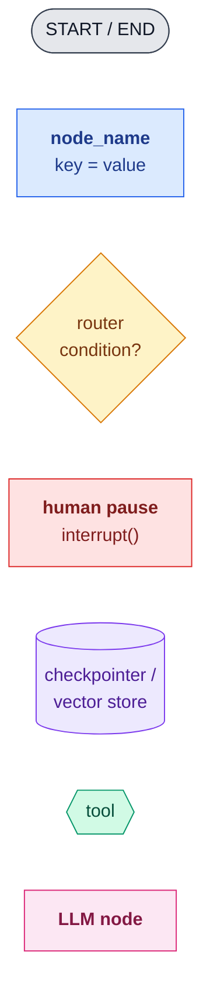

| Symbol | Meaning |
|---|---|
| Rounded grey pill | `START` / `END`, the built-in entry and exit points |
| Blue rectangle | A **node**, a plain function. Lines inside show what it writes to state |
| Yellow diamond | A **router**, the function passed to `add_conditional_edges`. It picks the next node but writes nothing |
| Solid arrow `-->` | A normal edge that always runs |
| Dashed arrow `-.->` | A conditional edge, taken only when its label matches |
| Red rectangle | A node that pauses with `interrupt()` and waits for a human |
| Purple cylinder | Storage outside the graph: a checkpointer or a vector store |
| Green hexagon | A **tool** that an LLM can call |
| Pink rectangle | A node that calls an **LLM** |

How state edits are written inside nodes:

| Notation | Meaning |
|---|---|
| `key = value` | Overwrite (the default; the last writer wins) |
| `key += [x]` | Append through a **list reducer** (`Annotated[list, operator.add]`) |
| `key += 5` | Add through a **numeric reducer** (`Annotated[float, operator.add]`) |
| `reads: key` | The node reads this key but does not change it |

---

## Reference: Coffee Order
The starting example from [Nodes](./02-langgraph-core-concepts/md/nodes.md)
([code](./02-langgraph-core-concepts/code/coffee_order_pipeline.py)).
The other scenarios reuse its format.

**State:** `drink`, `size`, `price`, `in_stock`, `cup`, `status`

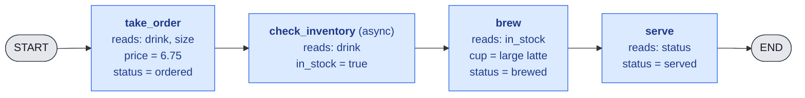

| After | drink | size | price | in_stock | cup | status |
|---|---|---|---|---|---|---|
| input | latte | large | 0.0 | false | "" | new |
| take_order | latte | large | **6.75** | false | "" | **ordered** |
| check_inventory | latte | large | 6.75 | **true** | "" | ordered |
| brew | latte | large | 6.75 | true | **large latte** | **brewed** |
| serve | latte | large | 6.75 | true | large latte | **served** |

---

## Beginner: Straight Pipelines (Nodes and Edges)

| Scenario | Nodes | What it teaches |
|---|---|---|
| **Pizza order** | `choose_size` → `add_toppings` → `bake` → `box` → `deliver` | Adding up a total across nodes; each node writes one field |
| **Laundry** | `sort` → `wash` → `dry` → `fold` | Very small, pure nodes; good first example for unit-testing a node |
| **Library book checkout** | `scan_card` → `check_fines` → `lend_book` → `set_due_date` | A computed field (due date) built from earlier state |
| **Movie ticket booking** | `pick_movie` → `pick_seat` → `apply_discount` → `print_ticket` | Overwriting the same key (`price`) across steps |
| **Car wash** | `pay` → `rinse` → `soap` → `dry` | Clearest "assembly line" picture; nice for a diagram |

### Pizza Order
**Teaches:** adding up a total across nodes. `add_toppings` reads the `total`
that `choose_size` wrote and adds to it.

**State:** `size`, `toppings`, `total`, `status`

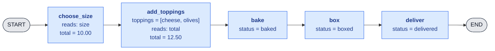

| After | size | toppings | total | status |
|---|---|---|---|---|
| input | large | [] | 0.00 | new |
| choose_size | large | [] | **10.00** | new |
| add_toppings | large | **[cheese, olives]** | **12.50** | new |
| bake | large | [cheese, olives] | 12.50 | **baked** |
| box | large | [cheese, olives] | 12.50 | **boxed** |
| deliver | large | [cheese, olives] | 12.50 | **delivered** |

### Laundry
**Teaches:** very small, pure nodes. Each node is a plain function of state,
so you can test it without building a graph:
`sort({"clothes": ["white shirt", "red sock"]})` returns
`{"piles": {"whites": 1, "colors": 1}}`.

**State:** `clothes`, `piles`, `status`

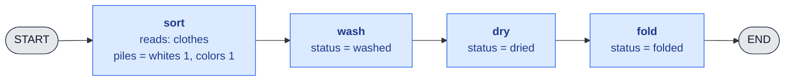

| After | clothes | piles | status |
|---|---|---|---|
| input | [white shirt, red sock] | {} | dirty |
| sort | [white shirt, red sock] | **{whites: 1, colors: 1}** | dirty |
| wash | [white shirt, red sock] | {whites: 1, colors: 1} | **washed** |
| dry | [white shirt, red sock] | {whites: 1, colors: 1} | **dried** |
| fold | [white shirt, red sock] | {whites: 1, colors: 1} | **folded** |

### Library Book Checkout
**Teaches:** a computed field. `set_due_date` calculates `due_date` from
`checkout_date`, which an earlier node wrote.

**State:** `card_id`, `book`, `member_ok`, `fines`, `on_loan`, `checkout_date`, `due_date`

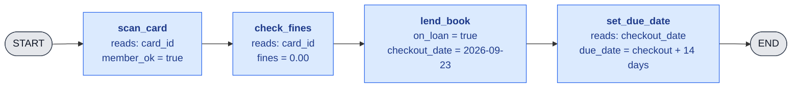

| After | member_ok | fines | on_loan | checkout_date | due_date |
|---|---|---|---|---|---|
| input | false | — | false | — | — |
| scan_card | **true** | — | false | — | — |
| check_fines | true | **0.00** | false | — | — |
| lend_book | true | 0.00 | **true** | **2026-09-23** | — |
| set_due_date | true | 0.00 | true | 2026-09-23 | **2026-10-07** |

### Movie Ticket Booking
**Teaches:** overwriting the same key. Three nodes write `price`, and the
last one to write wins.

**State:** `movie`, `seat`, `price`, `ticket`

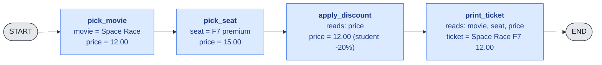

| After | movie | seat | price | ticket |
|---|---|---|---|---|
| input | — | — | 0.00 | — |
| pick_movie | **Space Race** | — | **12.00** | — |
| pick_seat | Space Race | **F7** | **15.00** | — |
| apply_discount | Space Race | F7 | **12.00** | — |
| print_ticket | Space Race | F7 | 12.00 | **Space Race F7 12.00** |

### Car Wash
**Teaches:** the assembly-line picture. This sequence diagram shows the
ticket going into each station and the partial update coming back.
LangGraph merges each update into the state before the next node runs.

**State:** `paid`, `stage`

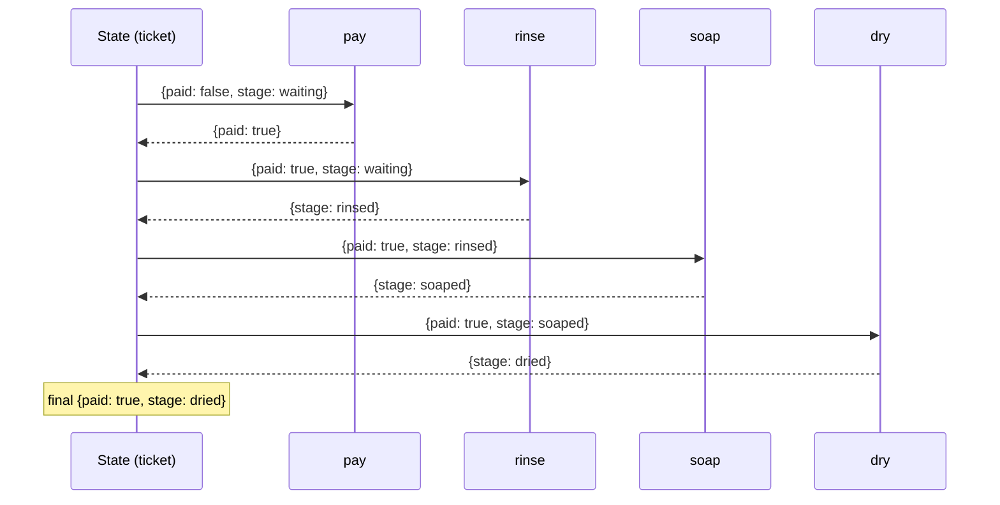

| After | paid | stage |
|---|---|---|
| input | false | waiting |
| pay | **true** | waiting |
| rinse | true | **rinsed** |
| soap | true | **soaped** |
| dry | true | **dried** |

---

## Intermediate: Branching (Conditional Edges and Routers)

| Scenario | Branch point | What it teaches |
|---|---|---|
| **Airport check-in** | `check_bag_weight` routes to `pay_overweight_fee` or `print_boarding_pass` | A basic if/else router |
| **ATM withdrawal** | `verify_pin` routes to `dispense_cash` or `lock_card` after 3 failures | Loops with a counter, plus an END reached early |
| **Hospital triage** | `assess` routes to `emergency`, `urgent` or `routine` | Branching to one of several nodes |
| **Restaurant kitchen** | `take_order` sends each dish to `grill`, `fryer` and `salad` in parallel, then `plate` | Parallel branches that join again (fan-out/fan-in) |
| **Coffee v2** | `check_inventory` routes to `brew` or `suggest_alternative` | Turns the coffee example into a branching one |

### Airport Check-in
**Teaches:** a basic if/else router. The router reads `bag_kg` and returns
the name of the next node. It does not write to state.

**State:** `passenger`, `bag_kg`, `fee`, `boarding_pass`

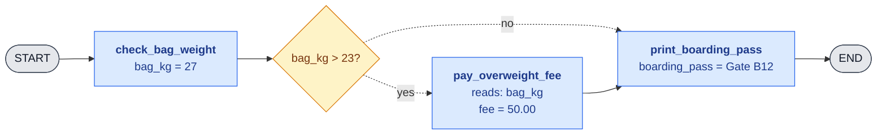

| After | bag_kg | fee | boarding_pass |
|---|---|---|---|
| input | 0 | 0.00 | — |
| check_bag_weight | **27** | 0.00 | — |
| *router: 27 > 23 → yes* | | | |
| pay_overweight_fee | 27 | **50.00** | — |
| print_boarding_pass | 27 | 50.00 | **Gate B12** |

### ATM Withdrawal
**Teaches:** a loop with a counter, and reaching `END` early from different
branches. The router can send the flow back to an earlier node.

**State:** `pin_entered`, `attempts`, `pin_ok`, `cash`, `card_locked`

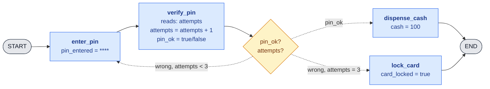

Trace for a customer who gets the PIN wrong three times:

| After | attempts | pin_ok | cash | card_locked |
|---|---|---|---|---|
| input | 0 | false | 0 | false |
| enter_pin → verify_pin | **1** | false | 0 | false |
| *router: wrong, 1 < 3 → loop* | | | | |
| enter_pin → verify_pin | **2** | false | 0 | false |
| *router: wrong, 2 < 3 → loop* | | | | |
| enter_pin → verify_pin | **3** | false | 0 | false |
| *router: wrong, attempts = 3* | | | | |
| lock_card | 3 | false | 0 | **true** |

### Hospital Triage
**Teaches:** a router that picks one of several nodes. The router returns a
node name, and only that branch runs.

**State:** `symptoms`, `severity`, `ward`, `wait_minutes`

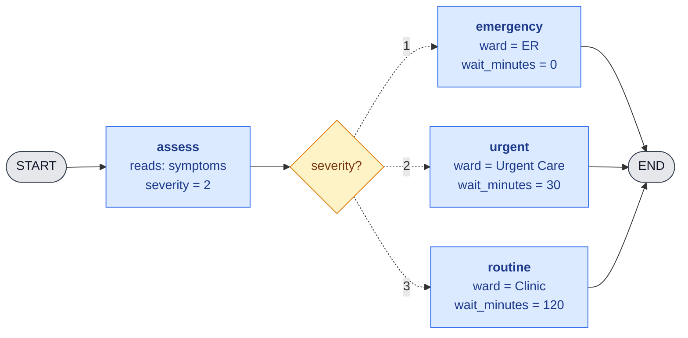

| After | severity | ward | wait_minutes |
|---|---|---|---|
| input | — | — | — |
| assess | **2** | — | — |
| *router: severity 2 → urgent* | | | |
| urgent | 2 | **Urgent Care** | **30** |

### Restaurant Kitchen
**Teaches:** parallel branches that join again (fan-out/fan-in). `grill`,
`fryer` and `salad` run in the **same step** and all write to `ready`.
When several nodes write the same key in one step, the key needs a
**reducer**. Without one, LangGraph raises `InvalidUpdateError`.

**State:** `dishes`, `ready: Annotated[list, operator.add]`, `status`

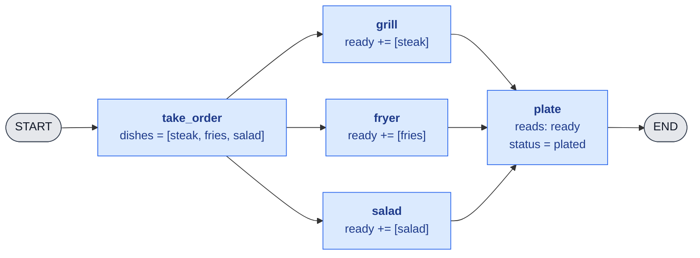

| After | dishes | ready | status |
|---|---|---|---|
| input | [] | [] | new |
| take_order | **[steak, fries, salad]** | [] | new |
| grill + fryer + salad (same step) | [steak, fries, salad] | **[steak, fries, salad]** | new |
| plate | [steak, fries, salad] | [steak, fries, salad] | **plated** |

### Coffee v2
**Teaches:** turning a straight pipeline into a branching one. This is the
reference coffee order with a router added after `check_inventory`.

**State:** `drink`, `size`, `price`, `in_stock`, `cup`, `suggestion`, `status`

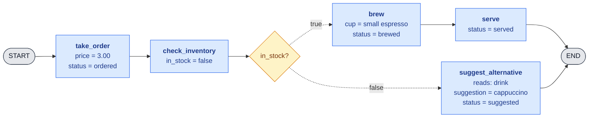

| After | drink | in_stock | cup | suggestion | status |
|---|---|---|---|---|---|
| input | espresso | false | "" | — | new |
| take_order | espresso | false | "" | — | **ordered** |
| check_inventory | espresso | **false** | "" | — | ordered |
| *router: in_stock false* | | | | | |
| suggest_alternative | espresso | false | "" | **cappuccino** | **suggested** |

---

## Intermediate: State and Reducers

| Scenario | Idea | What it teaches |
|---|---|---|
| **Grocery shopping cart** | Each aisle node appends items | A list reducer (`Annotated[list, operator.add]`) |
| **Package tracking** | Each hub node adds a scan event | Keeping an append-only history in state |
| **Restaurant bill split** | Each diner node adds their share | Adding numbers up with a reducer |

### Grocery Shopping Cart
**Teaches:** a list reducer. Each aisle returns only its **new** items.
The reducer appends them to the cart instead of replacing it.

**State:** `cart: Annotated[list, operator.add]`, `total`

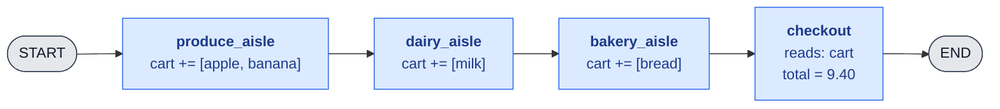

| After | node returned | cart (after reducer) | total |
|---|---|---|---|
| input | — | [] | 0.00 |
| produce_aisle | `{cart: [apple, banana]}` | **[apple, banana]** | 0.00 |
| dairy_aisle | `{cart: [milk]}` | **[apple, banana, milk]** | 0.00 |
| bakery_aisle | `{cart: [bread]}` | **[apple, banana, milk, bread]** | 0.00 |
| checkout | `{total: 9.40}` | [apple, banana, milk, bread] | **9.40** |

> Without the reducer, `dairy_aisle` returning `{cart: [milk]}` would
> **replace** the cart, and the apple and banana would be lost.

### Package Tracking
**Teaches:** an append-only history kept next to a current value. In the
same state, `location` is **overwritten** and `history` is **appended to**.

**State:** `location` (overwrite), `history: Annotated[list, operator.add]` (append)

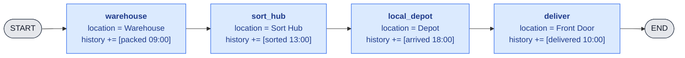

| After | location (overwrite) | history (append) |
|---|---|---|
| input | — | [] |
| warehouse | **Warehouse** | **[packed]** |
| sort_hub | **Sort Hub** | **[packed, sorted]** |
| local_depot | **Depot** | **[packed, sorted, arrived]** |
| deliver | **Front Door** | **[packed, sorted, arrived, delivered]** |

### Restaurant Bill Split
**Teaches:** adding numbers up with a reducer. Three diner nodes run in
parallel and each add their share to `paid`. The reducer is
`operator.add` on a float.

**State:** `total`, `paid: Annotated[float, operator.add]`, `balance`

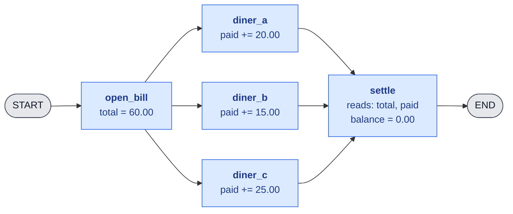

| After | total | paid | balance |
|---|---|---|---|
| input | 0.00 | 0.00 | — |
| open_bill | **60.00** | 0.00 | — |
| diner_a + diner_b + diner_c (same step) | 60.00 | **60.00** (20 + 15 + 25) | — |
| settle | 60.00 | 60.00 | **0.00** |

---

## Intermediate: Persistence and Human in the Loop

| Scenario | Pause point | What it teaches |
|---|---|---|
| **Expense report** | `submit` → **manager approval** → `reimburse` | `interrupt()` and resuming the run |
| **Online food delivery** | The order is saved and the app is closed, then tracking is checked later | Checkpointers and `thread_id` |
| **Hotel booking** | Hold the room until the guest confirms | A pause with a timeout, then resume or cancel |

### Expense Report
**Teaches:** `interrupt()` and resuming. `manager_approval` pauses the
graph and the checkpointer saves the state. Later the manager resumes it
with `Command(resume="approve")`, and that value becomes `interrupt()`'s
return value.

**State:** `employee`, `amount`, `approved`, `status`

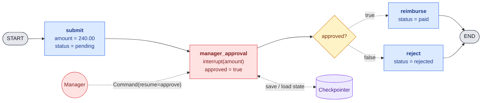

| After | amount | approved | status | run state |
|---|---|---|---|---|
| input | — | false | new | running |
| submit | **240.00** | false | **pending** | running |
| manager_approval (1st run) | 240.00 | false | pending | **paused, saved to checkpointer** |
| manager_approval (resumed) | 240.00 | **true** | pending | running |
| reimburse | 240.00 | true | **paid** | done |

### Online Food Delivery
**Teaches:** checkpointers and `thread_id`. Each run saves a checkpoint
after every step. Later, even in a new session, the same `thread_id` loads
the saved state.

**State:** `order`, `stage`, `eta_minutes`

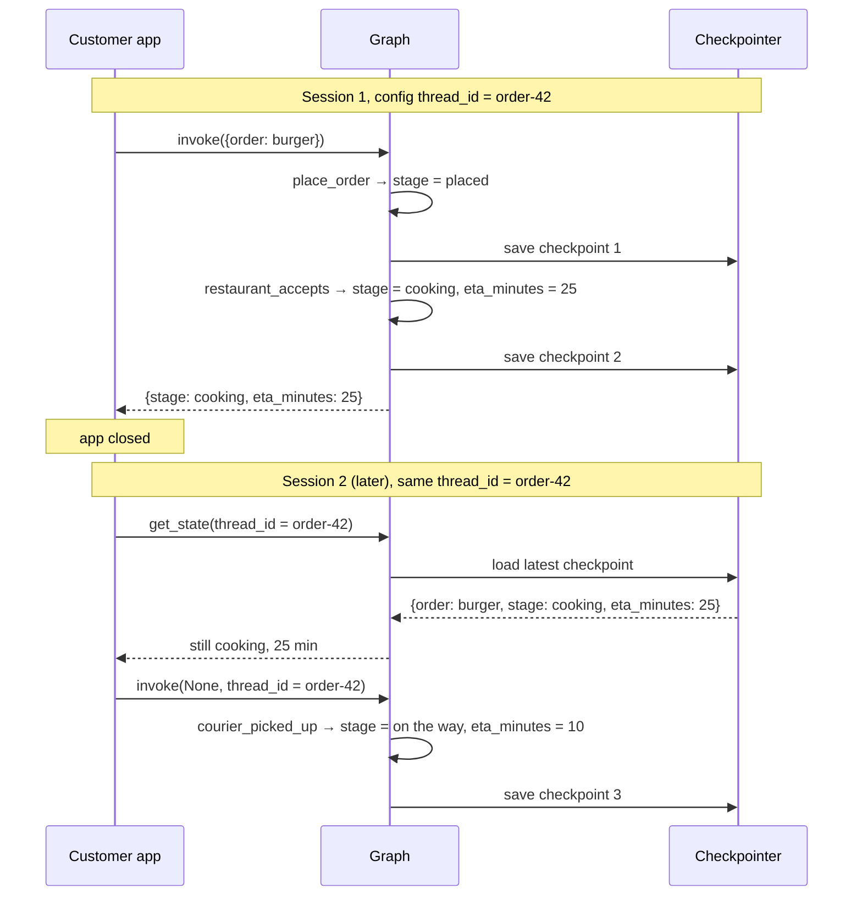

| Checkpoint | node | order | stage | eta_minutes |
|---|---|---|---|---|
| 1 | place_order | burger | **placed** | — |
| 2 | restaurant_accepts | burger | **cooking** | **25** |
| *app closed, reopened later* | | | | |
| 3 | courier_picked_up | burger | **on the way** | **10** |

### Hotel Booking
**Teaches:** a pause with a timeout, then resume or cancel. The graph holds
the room and pauses. If the guest confirms, it charges the card. If they
decline or the hold expires, it releases the room.

**State:** `room`, `hold_until`, `decision`, `status`

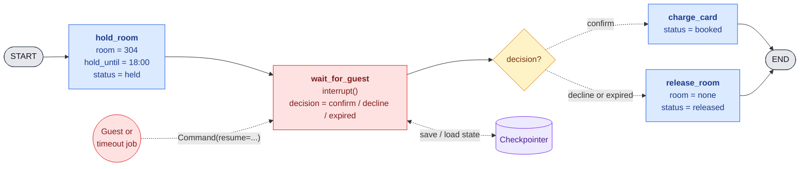

| After | room | hold_until | decision | status |
|---|---|---|---|---|
| input | — | — | — | new |
| hold_room | **304** | **18:00** | — | **held** |
| wait_for_guest (paused) | 304 | 18:00 | — | held |
| wait_for_guest (resumed, expired) | 304 | 18:00 | **expired** | held |
| release_room | **none** | 18:00 | expired | **released** |

---

## Advanced: Agents, Tools and Multi-Agent

| Scenario | Idea | What it teaches |
|---|---|---|
| **Travel agent** | An LLM calls `search_flights`, `search_hotels` and `check_weather` tools | A tool-calling loop |
| **Newspaper office** | `reporter` → `editor` → `fact_checker` → `publisher` agents | Multi-agent handoffs |
| **Customer support desk** | A `receptionist` routes to `billing_agent` or `tech_agent` | The supervisor pattern |
| **Recipe assistant** | Retrieve recipes, then answer "what can I cook with eggs and rice?" | RAG |

### Travel Agent
**Teaches:** the tool-calling loop. The LLM node either asks for tools or
answers. `tools_condition` routes to the `ToolNode` whenever tools were
requested, and the tool results go back to the LLM. The `messages` key uses
the `add_messages` reducer, so every turn is appended.

**State:** `messages: Annotated[list, add_messages]`

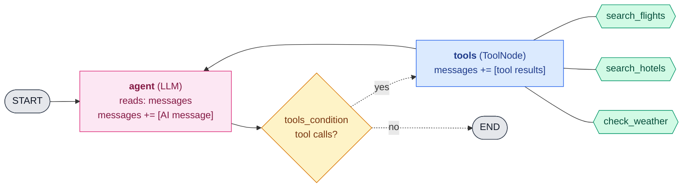

| After | messages appended this step | total messages |
|---|---|---|
| input | **Human:** "Plan 3 days in Lisbon next week" | 1 |
| agent | **AI:** calls search_flights, search_hotels, check_weather | 2 |
| *router: tool calls → tools* | | |
| tools | **Tool:** flights 180, **Tool:** hotel 95/night, **Tool:** sunny 24°C | 5 |
| agent | **AI:** "Here's your plan: fly Tue, stay at..." | 6 |
| *router: no tool calls → END* | | |

### Newspaper Office
**Teaches:** multi-agent handoffs with a revision loop. Each agent is a
node with its own role. `draft` is overwritten on each revision, while
`notes` keeps every agent's feedback through a reducer.

**State:** `draft` (overwrite), `notes: Annotated[list, operator.add]`, `revisions`, `status`

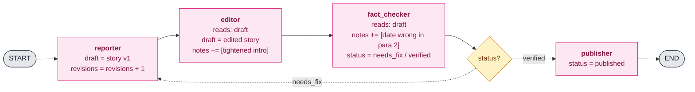

| After | draft | notes | revisions | status |
|---|---|---|---|---|
| input | — | [] | 0 | new |
| reporter | **story v1** | [] | **1** | new |
| editor | **edited v1** | **[tightened intro]** | 1 | new |
| fact_checker | edited v1 | **[..., date wrong]** | 1 | **needs_fix** |
| *router: needs_fix → reporter* | | | | |
| reporter | **story v2** | [...] | **2** | needs_fix |
| editor | **edited v2** | **[..., ok]** | 2 | needs_fix |
| fact_checker | edited v2 | **[..., verified]** | 2 | **verified** |
| publisher | edited v2 | [...] | 2 | **published** |

### Customer Support Desk
**Teaches:** the supervisor pattern. A `receptionist` (supervisor) reads the
conversation and chooses which specialist handles it next. Specialists
always report back to the supervisor, and it decides when the conversation
is finished.

**State:** `messages: Annotated[list, add_messages]`, `next_agent`

```mermaid
flowchart TB
    classDef router fill:#fef3c7,stroke:#d97706,color:#78350f
    classDef terminal fill:#e5e7eb,stroke:#374151,color:#111827
    classDef llm fill:#fce7f3,stroke:#db2777,color:#831843

    S([START]):::terminal --> SUP["<b>receptionist</b> (supervisor)<br/>reads: messages<br/>next_agent = billing / tech / done"]:::llm
    SUP --> R{"next_agent?"}:::router
    R -.->|billing| B["<b>billing_agent</b><br/>messages += [refund issued]"]:::llm
    R -.->|tech| T["<b>tech_agent</b><br/>messages += [reset router steps]"]:::llm
    R -.->|done| E([END]):::terminal
    B --> SUP
    T --> SUP
```

| After | messages appended | next_agent |
|---|---|---|
| input | **Human:** "I was double charged and my wifi is down" | — |
| receptionist | — | **billing** |
| billing_agent | **AI:** "Refund of 29.99 issued" | billing |
| receptionist | — | **tech** |
| tech_agent | **AI:** "Try these router reset steps..." | tech |
| receptionist | — | **done** |

### Recipe Assistant
**Teaches:** RAG (retrieval-augmented generation). The graph retrieves
recipes from a vector store, checks that they are relevant, and then
generates an answer from them. If nothing relevant comes back, it
rewrites the query and tries again.

**State:** `question`, `query`, `docs`, `relevant`, `answer`

```mermaid
flowchart LR
    classDef step fill:#dbeafe,stroke:#2563eb,color:#1e3a8a
    classDef router fill:#fef3c7,stroke:#d97706,color:#78350f
    classDef terminal fill:#e5e7eb,stroke:#374151,color:#111827
    classDef store fill:#ede9fe,stroke:#7c3aed,color:#4c1d95
    classDef llm fill:#fce7f3,stroke:#db2777,color:#831843

    S([START]):::terminal --> A["<b>retrieve</b><br/>reads: query<br/>docs = top 3 recipes"]:::step
    VS[("Vector store<br/>recipes")]:::store -.-> A
    A --> G["<b>grade_docs</b> (LLM)<br/>reads: question, docs<br/>relevant = true / false"]:::llm
    G --> R{"relevant?"}:::router
    R -.->|true| GEN["<b>generate</b> (LLM)<br/>reads: question, docs<br/>answer = egg fried rice..."]:::llm
    R -.->|false| RW["<b>rewrite_query</b> (LLM)<br/>query = eggs rice quick dinner"]:::llm
    RW --> A
    GEN --> E([END]):::terminal
```

| After | query | docs | relevant | answer |
|---|---|---|---|---|
| input | what can I cook with eggs and rice? | [] | — | — |
| retrieve | same | **[omelette, pudding, sushi]** | — | — |
| grade_docs | same | [...] | **false** | — |
| *router: false → rewrite* | | | | |
| rewrite_query | **eggs rice quick dinner** | [...] | false | — |
| retrieve | eggs rice quick dinner | **[egg fried rice, congee, bibimbap]** | false | — |
| grade_docs | eggs rice quick dinner | [...] | **true** | — |
| generate | eggs rice quick dinner | [...] | true | **Egg fried rice: ...** |

---

## The Coffee Shop Story Arc
One scenario grows through the whole tutorial, and each lesson adds one new
concept to a coffee shop readers already understand.

| # | Lesson | Coffee shop feature | New concept |
|---|---|---|---|
| 1 | Nodes | Coffee order | Nodes, partial updates |
| 2 | Conditional edges | A sold-out drink routes to `suggest_alternative` | Routers |
| 3 | Reducers | Several drinks in one order | List reducer |
| 4 | Parallel | Brew the drink and warm a pastry at the same time | Fan-out / fan-in |
| 5 | Human in the loop | A barista approves a custom order | `interrupt()` |
| 6 | Persistence | A loyalty card remembers past orders | Checkpointer, `thread_id` |
| 7 | Agents | An LLM barista takes orders in natural language | Tools, agent loop |

```mermaid
flowchart TB
    classDef beginner fill:#d1fae5,stroke:#059669,color:#064e3b
    classDef intermediate fill:#dbeafe,stroke:#2563eb,color:#1e3a8a
    classDef advanced fill:#fef3c7,stroke:#d97706,color:#78350f

    L1["<b>1. Coffee order</b><br/>nodes, partial updates"]:::beginner
    L2["<b>2. Sold out?</b><br/>router to suggest_alternative"]:::intermediate
    L3["<b>3. Multi-drink order</b><br/>drinks += [latte, mocha]"]:::intermediate
    L4["<b>4. Drink + pastry</b><br/>parallel brew and warm_pastry"]:::intermediate
    L5["<b>5. Custom order</b><br/>barista interrupt()"]:::intermediate
    L6["<b>6. Loyalty card</b><br/>checkpointer, thread_id"]:::advanced
    L7["<b>7. LLM barista</b><br/>tools + agent loop"]:::advanced

    L1 --> L2 --> L3 --> L4 --> L5 --> L6 --> L7
```

This is what the coffee shop graph looks like after lesson 7, with every
concept above used together:

```mermaid
flowchart LR
    classDef step fill:#dbeafe,stroke:#2563eb,color:#1e3a8a
    classDef router fill:#fef3c7,stroke:#d97706,color:#78350f
    classDef terminal fill:#e5e7eb,stroke:#374151,color:#111827
    classDef human fill:#fee2e2,stroke:#dc2626,color:#7f1d1d
    classDef store fill:#ede9fe,stroke:#7c3aed,color:#4c1d95
    classDef tool fill:#d1fae5,stroke:#059669,color:#064e3b
    classDef llm fill:#fce7f3,stroke:#db2777,color:#831843

    S([START]):::terminal --> BAR["<b>llm_barista</b><br/>messages += [AI]<br/>drinks += [...]"]:::llm
    BAR --> TR{"tool calls?"}:::router
    TR -.->|yes| TOOLS["<b>tools</b><br/>messages += [results]"]:::step
    TOOLS --> BAR
    TOOLS --- MENU{{"lookup_menu"}}:::tool
    TOOLS --- LOY{{"loyalty_points"}}:::tool
    TR -.->|no| INV["<b>check_inventory</b><br/>in_stock = true/false"]:::step
    INV --> SR{"in_stock?"}:::router
    SR -.->|false| ALT["<b>suggest_alternative</b><br/>suggestion = ..."]:::step
    ALT --> BAR
    SR -.->|true| CR{"custom order?"}:::router
    CR -.->|yes| APP["<b>barista_approval</b><br/>interrupt()"]:::human
    CR -.->|no| BREW
    APP --> BREW["<b>brew</b><br/>cups += [...]"]:::step
    APP --> PAST["<b>warm_pastry</b><br/>cups += [croissant]"]:::step
    CR -.->|no| PAST
    BREW --> SERVE["<b>serve</b><br/>status = served"]:::step
    PAST --> SERVE
    SERVE --> E([END]):::terminal
    SERVE <-. "thread_id = customer-7" .-> CP[("Checkpointer<br/>loyalty history")]:::store
```
