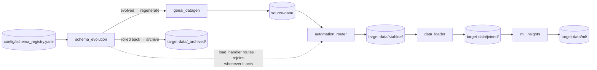
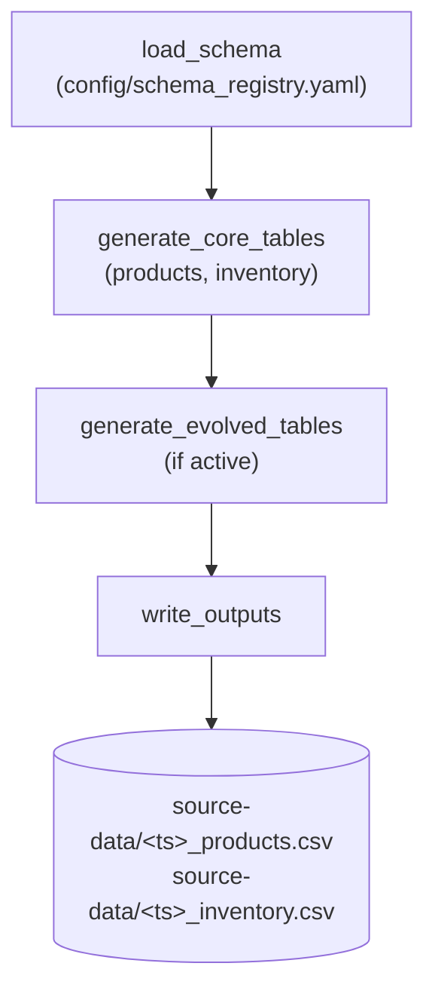
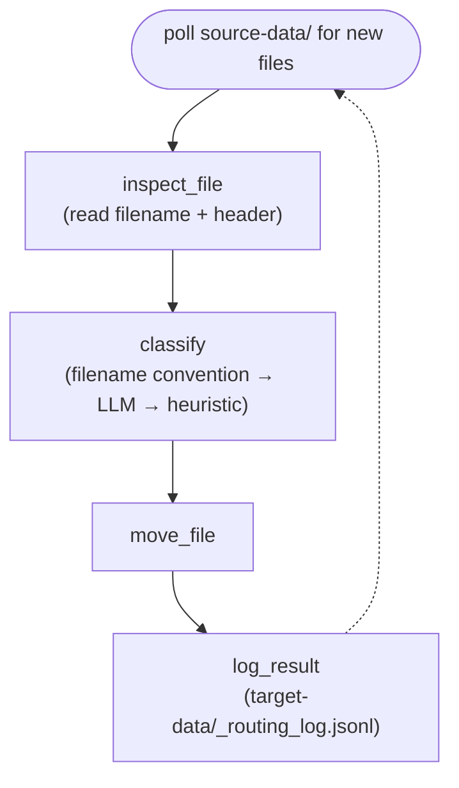
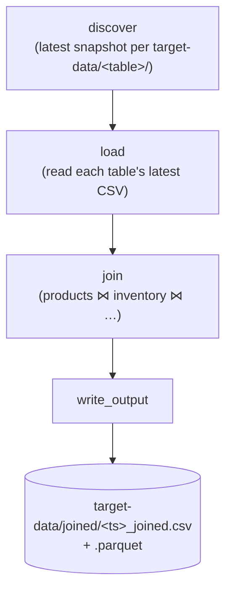
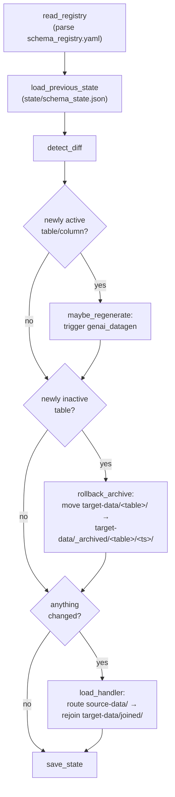
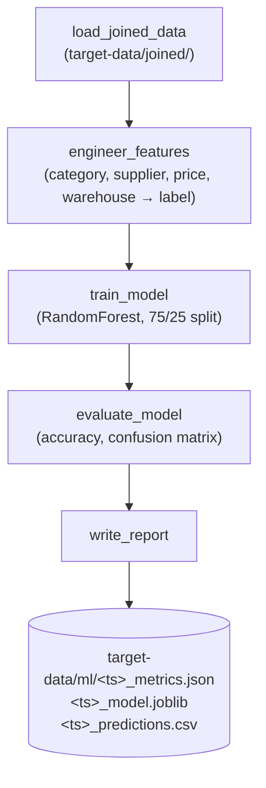

# Create LangGraph programs for 
* genAI: create a program to generate csv data (in python for inventory-products data sets - 2 csv files by timestamp prepend in names for every generation)
* with provisions to add new columns, have them commented as I want agentic to regenerate, were lets say Initially I have products and inventory, later add product-category, products, inventory and then product-prices-month-year in another table
* Automation
    * When a new file is created in source-data move it to target data subfolder based on the name, based on the name, like sales-2034, daily-sale, any name 
      use ollama AI with the keys in D:\GIT-CODE\git_venkata\langgraph\settings.config
* Generate Data load to target with join of the tables
* Agents: give me ideas
* Agentic: detect schema evolution and

---

## Implementation

Five LangGraph programs, wired together by CLI scripts:

| Pipeline | Source | What it does |
|---|---|---|
| `genai_datagen` | [src/genai_datagen](src/genai_datagen) | Faker-generated `products`/`inventory` rows (+ any active evolved tables), with a one-time LLM call for realistic category/supplier names. Writes timestamped CSVs to `source-data/`. |
| `automation_router` | [src/automation_router](src/automation_router) | Polls `source-data/` for new files, classifies each by filename/header, and moves it into the matching `target-data/<table>/` subfolder. Falls back through Ollama Cloud → Groq → OpenRouter, then a keyword heuristic if every LLM call fails. |
| `data_loader` | [src/data_loader](src/data_loader) | Loads each `target-data/<table>/` folder's *latest* snapshot and joins `products` + `inventory` (+ `product-category` / `suppliers` / `product-prices-month-year` once active) into one denormalized CSV/Parquet under `target-data/joined/`. |
| `schema_evolution` | [src/schema_evolution](src/schema_evolution) | Diffs [config/schema_registry.yaml](config/schema_registry.yaml) against its last snapshot in `state/schema_state.json` — in both directions. Uncommenting a column / activating a table (**evolution**) triggers a fresh `genai_datagen` run; re-commenting a column / deactivating a table (**rollback**) archives that table's stale `target-data/` folder so it drops out of the join instead of lingering. Its `load_handler` node then routes + rejoins `target-data/` itself, so the loop is fully self-contained. This is the project's **agentic loop** demo. |
| `ml_insights` | [src/ml_insights](src/ml_insights) | This is the project's **ML** demo: trains + evaluates a reorder-risk classifier over the latest joined dataset, writes a metrics report, a persisted model, and per-row predictions to `target-data/ml/`. |

Agent brainstorm answering "Agents: give me ideas" lives in [docs/agent-ideas.md](docs/agent-ideas.md).

### Architecture



`schema_evolution`'s own `load_handler` node (dotted edge) already drives `automation_router` + `data_loader` whenever it evolves or rolls back the schema, so the agentic loop is self-contained end to end. See [Demos](#demos) below for how to run each stage.

### Setup

```powershell
python -m venv .venv
.\.venv\Scripts\pip install -r requirements.txt
```

API keys are read from `D:\GIT-CODE\git_venkata\langgraph\settings.config` (one directory above this repo) — no `.env` needed. Override the path via the `SETTINGS_CONFIG_PATH` environment variable if you move it.

---

## Demos

Run the whole pipeline in one shot — schema check → generate → route → join → ML:
```powershell
.\.venv\Scripts\python scripts\run_pipeline_once.py
```

Or work through each demo below independently; each has its own objective, flow diagram, and testing steps with the exact command(s) for just that stage.

### Demo 1 — genAI Data Generation

**Objective**: show a LangGraph program synthesizing realistic CSV datasets — Faker for row volume, one cached LLM call for on-theme reference values (category/supplier names) — and dropping timestamp-prefixed files where a real upstream source would land.



**Testing**:
```powershell
.\.venv\Scripts\python scripts\run_genai_datagen.py --count 60
```
Check `source-data/` for two new files named `<timestamp>_products.csv` / `<timestamp>_inventory.csv`. Open `state/reference_data_cache.json` — `"source": "ollama_cloud"` (or `groq`/`openrouter`) confirms a live LLM call produced the category/supplier list; `"source": "fallback"` means every provider was unreachable and it used the static backup list instead — the pipeline still runs either way.

### Demo 2 — Automation (File Router)

**Objective**: show an agent that watches a drop folder and makes a real routing decision on unpredictable input — an LLM classifying a filename/header it's never seen into the correct destination folder — with a heuristic fallback so it never just stops working.



**Testing**:
```powershell
.\.venv\Scripts\python scripts\run_automation_router.py --once
```
Confirm the products/inventory files from Demo 1 moved into `target-data/products/` and `target-data/inventory/`. Then drop a file with a genuinely unpredictable name into `source-data/` — e.g. save a small CSV as `daily-sale-08-23.csv` with header `region,amount` — and run `--once` again. Check `target-data/_routing_log.jsonl` for the LLM's `target_folder` choice and `reasoning` on a file that doesn't match the generator's naming convention.

### Demo 3 — Data Load & Join

**Objective**: show the payoff of routing — independently generated, independently routed tables joined back into one denormalized dataset. Each `genai_datagen` run writes a *complete fresh snapshot* (IDs restart at `P00001`), so the loader always joins each table's latest file rather than accumulating history across runs — otherwise reused IDs across unrelated runs would fan out the join.



**Testing**:
```powershell
.\.venv\Scripts\python scripts\run_data_loader.py
```
Open the newest file in `target-data/joined/` and confirm rows carry both `products` columns (`category`, `unit_price`, `supplier`) and `inventory` columns (`quantity_on_hand`, `warehouse`) on the same `product_id` row.

### Demo 4 — Agentic Loop (Schema Evolution + Rollback)

**Objective**: this is the project's **agentic loop** demo. The schema registry file is the durable state the agent watches; the loop is *observe → diff → decide → act → reload → persist new state*, re-run every time. A human editing a config file — uncommenting a line, or re-commenting one — is treated exactly like any other external event the agent reacts to on its own, no code changes required. The loop is symmetric: activating a table/column is **evolution** (regenerate data to include it); deactivating one is **rollback** (archive its now-stale data out of the join path, without deleting it). Crucially, the `load_handler` node makes the loop *self-contained*: it routes whatever `genai_datagen` just wrote and rejoins `target-data/`, so a single run of `run_schema_evolution_check.py` leaves `target-data/joined/` fully up to date on its own — no separate router/loader script required.



**Testing — evolution**:
1. `run_schema_evolution_check.py` once to establish a baseline snapshot — a second immediate run should print `No schema changes detected.` (and touch nothing under `target-data/`).
2. Edit [config/schema_registry.yaml](config/schema_registry.yaml): uncomment `# - product_category_id` and `# - supplier_id` under `products`, and flip both `product-category`'s and `suppliers`' `active:` to `true`.
3. Re-run — the console prints the exact diff (`newly_active_tables`, `newly_active_columns`), regenerates data, and `load_handler` routes + rejoins it in the same pass: `target-data/product-category/` and `target-data/suppliers/` now exist, and the freshly-written `target-data/joined/<ts>_joined.csv` already includes `category_name` and `supplier_name` — no need to separately run the router or loader.

**Testing — rollback**:
4. Flip `suppliers`' `active:` back to `false` and re-run `run_schema_evolution_check.py`. The console prints `newly_inactive_tables: ['suppliers']`, `Rolled back tables archived: {...}`, and `load_handler` rejoins immediately after.
5. Confirm `target-data/suppliers/` no longer exists, but its files are safe under `target-data/_archived/suppliers/<ts>/`, the event is logged in `target-data/_rollback_log.jsonl`, and the newest `target-data/joined/<ts>_joined.csv` already has `supplier_name`/`region` gone while `category_name` remains (product-category is still active).
6. Run the schema check once more with no edits — confirms the loop is idempotent: no regeneration, no archiving, and `load_handler` is a no-op (it only acts when `regenerated` or `archived` is non-empty), so no new `target-data/joined/` file is written.

### Demo 5 — ML (Reorder-Risk Classifier)

**Objective**: this is the project's **ML** demo — an actual supervised-learning step consuming the pipeline's own output. It predicts which products are at reorder risk using only `category` / `supplier` / `unit_price` / `warehouse`, deliberately excluding `quantity_on_hand` and `reorder_level` (the columns the label is derived from) so it's a real predictive task, not a lookup. The generator bakes a genuine signal into the data for this to learn: roughly 40% of categories are systematically higher stockout risk, picked deterministically via a hash of the category name (so it works regardless of which category names the LLM invents that run) rather than hardcoded category strings.



**Testing**:
```powershell
.\.venv\Scripts\python scripts\run_data_loader.py   # ensure a joined dataset exists first
.\.venv\Scripts\python scripts\run_ml_demo.py
```
Check the printed accuracy — it should sit meaningfully above the ~50% no-signal baseline because of the injected per-category risk bias (a `--count 300` run typically lands around 80–90% accuracy). Inspect `target-data/ml/<ts>_metrics.json` for the full classification report + confusion matrix, and `<ts>_predictions.csv` for individual test-set predictions vs actuals.